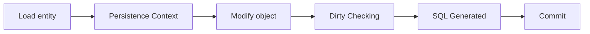

# JPA + Hibernate: The What and Why

---

## The Problem

Objects live in memory.

Databases store rows in tables.

These two worlds do not match.

---

## The Mismatch

Objects have identity, references, and behavior.

Tables have rows, foreign keys, and joins.

Mapping between them is manual and repetitive.

---

## The Old Way (JDBC-Style)

- Write SQL for every read and write.
- Manually map rows to objects.
- Manually track changes and build updates.
- Hard to keep logic consistent and correct.

---

## The Core Goal

Make persistence boring.

Let engineers model the domain, not the database plumbing.

---

## What Is JPA

JPA is a specification.

It defines a contract for object persistence.

It does not execute SQL itself.

---

## What Is Hibernate

Hibernate is an implementation of JPA.

It is the runtime engine that makes JPA real.

---

## Mental Model

JPA is the protocol.

Hibernate is the runtime that enforces the protocol.

---

## The Translator Model

```
Object World  <->  JPA Contract  <->  Hibernate Engine  <->  SQL
```

---

## Persistence Context

An in-memory working set.

Hibernate tracks loaded entities here.

Think of it as a notebook of object state.

---

## Entity States

- New
- Managed
- Detached
- Removed

State changes drive SQL generation.

---

## Dirty Checking

Hibernate remembers original object values.

When the transaction ends, it computes diffs.

It generates UPDATE statements automatically.

---

## Lazy Loading

Load related data only when touched.

This avoids heavy queries up front.

But it can trigger hidden SQL later.

---

## Transactions (Conceptual)

A boundary for consistency.

Inside a transaction, Hibernate tracks all changes.

At commit, it synchronizes the database.

---

## High-Level Flow



---

## What JPA Solves

- Eliminates repetitive SQL and mapping code.
- Tracks object changes automatically.
- Makes domain modeling faster.
- Provides a consistent abstraction across databases.

---

## What JPA Costs

- Hidden SQL and implicit behavior.
- Performance overhead vs hand-written SQL.
- Memory overhead from tracking objects.
- Debugging can be harder without visibility.

---

## The Trade-Off

Developer speed up.

Operational complexity up.

---

## Why Observability Matters

If you cannot see the SQL, you cannot reason about behavior.

Tooling makes the hidden work visible.

---

## Key Takeaway

JPA is a contract.

Hibernate is the engine.

It trades control for productivity.

---

## If You Remember One Thing

Hibernate is a state machine watching your objects.

It turns object changes into SQL at transaction boundaries.

---

# End
